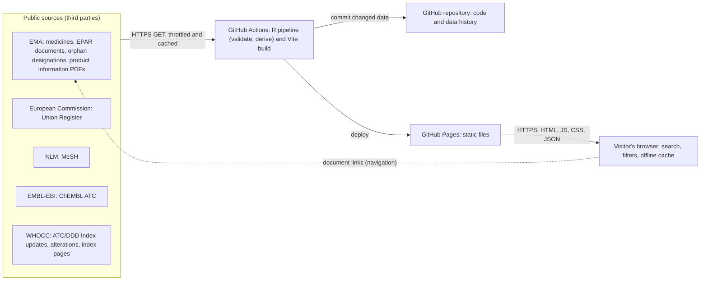

# MVSP self-assessment

Self-assessment of approval-atlas against the [Minimum Viable Secure Product](https://mvsp.dev/) checklist, latest release (v3.0).

- **Product:** approval-atlas — a static website (https://approval-atlas.vrognas.com) and its GitHub repository. No backend, no database, no accounts, no personal data. Solo, non-commercial project.
- **Reviewed:** 2026-09-26. **Next review:** 2027-09 (yearly, or after a significant change such as adding accounts or a backend).
- **Why MVSP and not ISO 27001 / SOC 2:** those certify organizations and their management systems; they do not fit a static site without users or user data.

Status: **Met**, **Partly met** (usually waiting for a GitHub setting listed under [Pending settings](#pending-settings)), or **N/A** (with the reason).

## Controls

| Control | Status | Evidence | Notes |
|---|---|---|---|
| 1.1 External vulnerability reports | Met | `SECURITY.md` (scope, safe harbor, contact, response targets); private vulnerability reporting enabled | Reports go through GitHub private vulnerability reporting. Triage: acknowledge within 7 days; fix per 3.4. |
| 1.2 Customer testing | Met | `SECURITY.md` safe harbor | Anyone may test the public site within the policy (no DoS). There is no non-production environment and no non-public data. |
| 1.3 Self-assessment | Met | This document | Reviewed yearly against the latest MVSP release. |
| 1.4 External testing | N/A | — | No backend, accounts or user data; solo non-commercial project. Checks instead: R and node tests, CSP and `npm audit` gate in CI; one-off headless-browser check and axe-core scan before release. |
| 1.5 Training | N/A | — | Solo project, no personnel. |
| 1.6 Compliance | Met | Privacy note in the site footer ("About this site"); `README.md` (source terms) | GDPR: the project collects no personal data — no cookies, analytics or tracking; searches run in the browser. The search is kept in the page address, so a reload or an opened link sends it to GitHub like any page request; GitHub, as host, may log IP addresses and page addresses (both stated in the privacy note). PCI DSS, HITRUST, ISO 27001, SSAE 18 and data localization: not applicable (no card, health or personal records; organization-level standards). Source reuse terms are followed and credited (README, footer). |
| 1.7 Incident handling | Met | `SECURITY.md` ("What to expect") | Notice on the site and in the README within 72 hours of confirming an incident that affected published data or code: what happened, contact (private vulnerability report), consequences, remediation. No sensitive information is held; the realistic incident is tampered code or data. |
| 1.8 Data handling | N/A | — | No storage media holding production data under the project's control; all data is public. Hosting storage is GitHub's. |
| 2.1 Single Sign-On | N/A | — | No accounts or logins. |
| 2.2 HTTPS-only | Partly met | GitHub Pages settings (custom domain set; "Enforce HTTPS" pending) | Pages serves HTTPS with a managed certificate and redirects HTTP once "Enforce HTTPS" is on (pending: certificate being issued). No HSTS header: GitHub Pages sends none on custom domains (accepted risk below). No cookies. TLS scan after go-live (pending). |
| 2.3 Security headers | Partly met | `site/index.html` (Content-Security-Policy meta tag) | Minimal CSP: `default-src 'self'`, scripts and styles from the site only (no inline), `object-src 'none'`, `base-uri 'self'`, `form-action 'none'`. Framing controls are not possible: a meta CSP ignores `frame-ancestors` and Pages cannot send `X-Frame-Options` (accepted risk below). No endpoints return sensitive data, so there is nothing to exclude from caching. |
| 2.4 Password policy | N/A | — | No passwords. |
| 2.5 Security libraries | Met | `site/src/no-html-sinks.test.js`; `site/src/table.js`, `site/src/documents.js` (+ tests) | DOM updates are text-only (D3 `.text()`, `textContent`, attributes); a test fails if `site/src` uses `innerHTML`, `outerHTML`, `insertAdjacentHTML`, `document.write` or D3 `.html()`. Links built from third-party data must be `https:`. D3 is maintained; no UI framework. |
| 2.6 Dependency patching | Met | `.github/dependabot.yml`; Dependabot alerts and security updates enabled; `npm audit --audit-level=high --omit=dev` step in `.github/workflows/pipeline.yml`; `renv.lock` | Runtime dependencies shipped to visitors: d3 and the Geist / Geist Mono fonts (@fontsource-variable, OFL-1.1, served same-origin). Dependabot version updates monthly (npm grouped; GitHub Actions). CI fails on high or critical runtime advisories. Medium advisories and known-exploited vulnerabilities: Dependabot alerts and security updates. R packages run only in CI, pinned by `renv.lock`. |
| 2.7 Logging | N/A | — | No authentication, users or customer data to log. Security-relevant configuration changes are recorded by git history and GitHub's audit log; CI runs are logged by GitHub Actions. |
| 2.8 Encryption | N/A | — | No sensitive data in transit or at rest. Transport security for the public site: see 2.2. |
| 3.1 List of data | Met | [Data inventory](#data-inventory) | |
| 3.2 Data flow diagram | Met | [Data flow](#data-flow) | |
| 3.3 Vulnerability prevention | Met | `AGENTS.md` (conventions); tests below | Authorization bypass, session management, CSRF: not applicable (no accounts, sessions, cookies or state-changing requests). Injection: no database or shell built from input; the MeSH XML is parsed without network access or entity expansion (`R/mesh.R`, `NONET`); EMA product information PDFs (URLs from EMA's documents index) are converted to text by the pipeline, in CI and in local backfill runs (`pdftools`/poppler, `R/smpc-atc.R`), from a temporary file that is then deleted, only when the file has a PDF header, and only well-formed ATC codes are kept; the WHOCC spreadsheets and HTML pages are parsed with `readxl` and `xml2` (`NONET`, `R/whocc.R`), and a format change stops the build; no LLM in the product. XSS: no HTML sinks (2.5), strict CSP, `https:`-only links from data. Untrusted data: source files are validated and the build fails loudly on unexpected values (`R/validate-ema.R`, 100% test coverage); URL parameters are checked against the data before use (`site/src/url.js`). |
| 3.4 Time to fix vulnerabilities | Met | `SECURITY.md` | Fix within 90 days of confirmation, exploited issues first; public GitHub security advisory after the fix. Visitors need to take no action: a new deploy replaces the site and its offline cache. |
| 3.5 Build and release process | Met | `.github/workflows/pipeline.yml` | Git on GitHub; the site is built and deployed only by the scripted CI workflow on GitHub-hosted runners, and each Pages deployment records its workflow run and commit (SLSA Build L1). Actions pinned by commit SHA. No stored secrets: only the automatic `GITHUB_TOKEN`, read-only by default, with `pages`/`id-token` write only in the deploy job and `contents: write` only in the data-commit job. Not done: signed build provenance (SLSA L2). |
| 4.1 Physical access | N/A | — | No own facilities or servers; GitHub hosts code, CI and the site. |
| 4.2 Logical access | Met | Repository ruleset "Protect main" (blocks force pushes and deletion on `main`); 2FA enabled on the owner's GitHub account (confirmed by the owner, 2026-09-27) | One owner with write access; no customer data. CI token permissions per 3.5. Access reviewed with this document yearly. |
| 4.3 Sub-processors | Met | [Sub-processors](#sub-processors) | |
| 4.4 Backup and disaster recovery | Met | [Backup and recovery](#backup-and-recovery) | |

## Data inventory

The project processes public regulatory data only. No personal data is collected, stored or processed.

| Data | Source | Sensitivity | Stored |
|---|---|---|---|
| Medicines: names, active substances, status, dates, indications, therapeutic areas, ATC codes, flags | EMA medicines data | Public | Repository (`site/public/data/`), GitHub Pages, visitors' offline cache |
| Marketing authorization holders (company names; business addresses from the public Union Register planned) | EMA, European Commission Union Register | Public business data | As above |
| EPAR document links, orphan designations | EMA | Public | As above |
| EU register status, orphan market exclusivity dates | European Commission Union Register | Public | As above |
| Therapeutic-area terms, tree branches and sub-areas (tree levels 2 and 3) | NLM MeSH | Public | As above |
| ATC classification names, status (current, retired, temporary) and replacement codes | ChEMBL (WHO ATC); WHOCC ATC/DDD Index site (update lists, cumulative alterations, single index pages); archived index copies (Internet Archive) | Public | As above |
| ATC codes read from section 5.1 of product information PDFs (a few per run), with the document link and date | EMA product information (SmPC) | Public | As above (`ema_medicine_smpc_atc.json`); the PDFs themselves are read in a temporary file and not kept |
| Source download cache | All of the above | Public | GitHub Actions cache (`.cache/downloads`) |
| Visitor data | — | None collected by the site | The browser keeps the site's files and data for offline use (service worker cache) on the visitor's device only. GitHub, as host, may log IP addresses and page addresses (which carry the lookup state, see [Data flow](#data-flow)). |

## Data flow

The browser only fetches the site's static files; searching and filtering send nothing. The lookup state (search text, medicine, substance or condition) is kept in the page address, so reloading a page or opening a shared link sends it to GitHub Pages with the page request. Document links open on EMA's website.

## Sub-processors

| Company | Role | Access to customer data |
|---|---|---|
| GitHub (Microsoft) | Hosting (Pages), CI (Actions), source code | None held by the project; as host, GitHub may log visitors' IP addresses |

DNS for `vrognas.com` is served by Netlify DNS (NS1). It answers DNS queries only and has no access to site content or visitor traffic.

GitHub is reviewed with this document yearly (its security documentation and compliance reports).

## Backup and recovery

- **Backup:** code, workflow and data history live in the Git repository on GitHub and in local clones on the owner's machine. All inputs are public sources that can be downloaded again.
- **Recovery:** clone the repository, then `Rscript scripts/run-pipeline.R`, `npm ci`, `npm run build`; or re-run the CI workflow, which rebuilds and redeploys the site.
- **Test:** every scheduled CI run rebuilds the site from a fresh clone on a new runner (sources restored from the download cache or downloaded again). A full rebuild on a clean machine is repeated at each yearly review.

## Accepted risk: headers GitHub Pages cannot set

GitHub Pages does not let a site set response headers.

- **No HSTS on custom domains.** A first visit typed as `http://` can be intercepted before the redirect to HTTPS.
- **No framing controls.** `X-Frame-Options` needs a header, and a CSP in a meta tag ignores `frame-ancestors`, so the site can be framed by another site (clickjacking).
- **CSP by meta tag only** (no reporting, no `sandbox`).

Accepted because the site has no logins, no state-changing actions and no personal data: interception or framing can show a visitor a wrong page but cannot take anything from them. Alternatives if that changes: HSTS with `includeSubDomains` and preload on the `vrognas.com` apex (served from Netlify), which covers the subdomain in browsers; or hosting on Netlify with a `_headers` file for full header control.

## Pending settings

The repository is public. Applied settings are checked; apply the rest with the owner's explicit OK:

- [x] Secret scanning and push protection
- [x] Private vulnerability reporting
- [x] Dependabot alerts and security updates
- [x] Ruleset on `main`: block force pushes and deletion
- [x] Confirm 2FA on the owner's GitHub account (2026-09-27)
- [x] GitHub Pages from GitHub Actions, custom domain `approval-atlas.vrognas.com` (DNS CNAME to `vrognas.github.io`)
- [ ] "Enforce HTTPS" once the certificate is issued
- [ ] TLS scan of the live site
